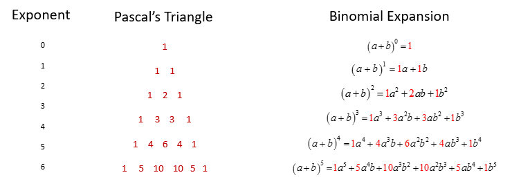

# Binomial_expansion-solver

<b>Program that expands a binomial usign Pascal's triangle.</b>
 
<h1>Method</h1>
The Pascal's triangle is a number pattern, represented as a triangular array, where each number is the sum of two numbers directly above it, creating rows that are numerated from zero to inifinity, top to bottom.

 Each row of the Pascal's triangle represents the coeficients of an expanded binomial with degree equivalent to the row's index, in the same order.

Therefore, using a program, we can correlate each row to its respective binomial degree, expanding the binomial.

